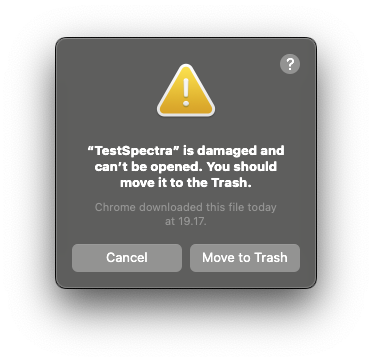

## TestSpectra Desktop Release

### 📦 Downloads

Download the appropriate installer for your platform from the assets below.

**macOS:**
- Apple Silicon (M1/M2/M3): `.dmg` file with `aarch64` in the name
- Intel: `.dmg` file with `x64` in the name

**Windows:**
- 64-bit: `.msi` installer file

### 🚀 Installation

**macOS:**
1. Download and open the DMG file
2. Drag TestSpectra to Applications folder
3. First launch: Right-click → Open (for Gatekeeper)

#### If you see "TestSpectra is damaged and can't be opened" on macOS



Open Terminal and run this command, then try opening the app again:

```bash
xattr -cr "/Applications/TestSpectra.app"
```

**Windows:**
1. Download and run the MSI installer
2. Follow the installation wizard
3. Launch from Start Menu

### 🔧 Self-Hosted API Configuration

By default, TestSpectra connects to the official cloud API. If you're running a self-hosted backend, configure the desktop app once using the `TEST_SPECTRA_API_URL` environment variable.

**macOS / Linux (set once for your shell):**

1. Edit your shell profile, for example `~/.zshrc` or `~/.bashrc`, and add:

```bash
export TEST_SPECTRA_API_URL="https://your-server.com/api"
```

2. Start a new Terminal session, then launch the app:

```bash
open -a TestSpectra
```

**Windows (set once for your user account):**

Run this once in Command Prompt:

```batch
setx TEST_SPECTRA_API_URL "https://your-server.com/api"
```

Then restart TestSpectra.

### ✨ Built with
- Tauri v2
- React + TypeScript
- Rust backend
