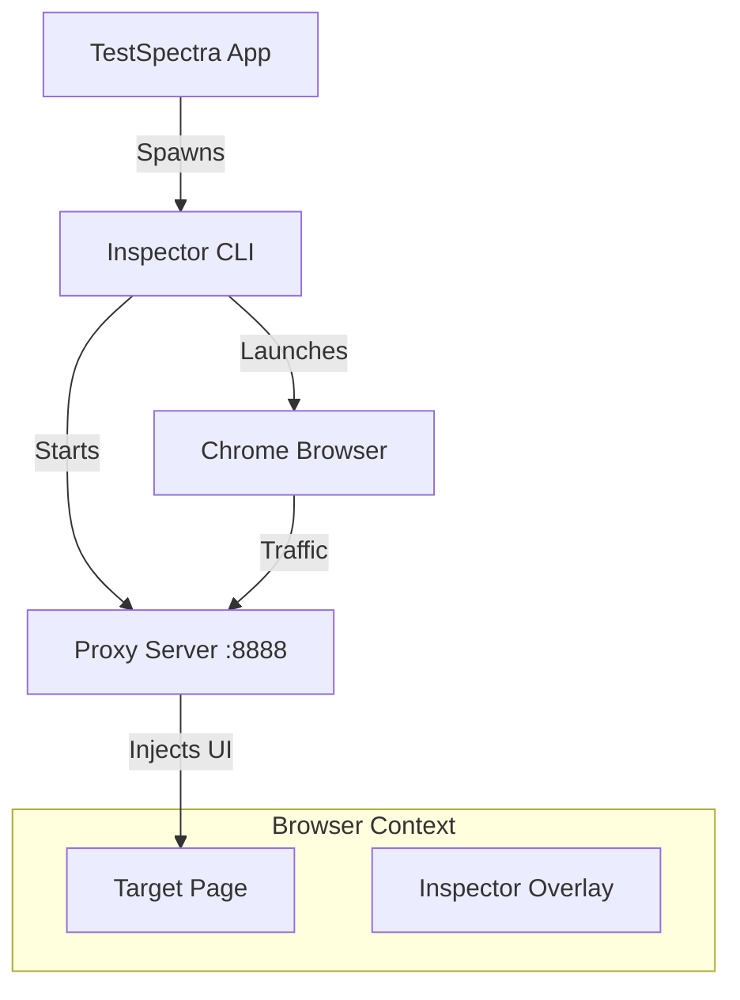

# Web Inspector for TestSpectra

## Overview

This package (`@testspectra/web-inspector`) provides the **Web Inspector** capability for TestSpectra. It is designed to be a lightweight, dependency-free tool that allows users to inspect web elements and generate robust selectors (CSS, XPath, etc.) for their automation tests.

Unlike traditional browser extensions, this inspector works by launching a controlled Chrome instance via **WebDriverIO** and injecting the inspector UI through a local MITM proxy. This ensures that the inspector works consistently across different sites and frames without requiring manual extension installation.

## Why This Package Exists

1.  **Seamless Integration**: It is launched directly from the TestSpectra Tauri app, providing a native experience.
2.  **No Heavy Bundling**: It leverages the user's existing global installation of `webdriverio` (via `npm install -g webdriverio`), keeping the TestSpectra installer small.
3.  **Cross-Origin Support**: By using a proxy server, the inspector UI can be injected into any page, regardless of Content Security Policy (CSP) or iframe restrictions.
4.  **Automation Ready**: It uses the same WebDriver protocol as the actual tests, ensuring that selectors found in the inspector will work in the test runner.

## How It Works

### 1. The Proxy Server (`bin/proxy-server.ts`)
A Node.js HTTP/HTTPS proxy server runs on port `8888`.
-   **Interception**: All traffic from the controlled browser goes through this proxy.
-   **Injection**: When the browser requests a page, the proxy injects a script tag that loads the Inspector UI (`client/index.html`) into the page.
-   **Static Serving**: It also serves the static assets (JS, CSS) for the inspector UI from the `/__/inspector` path.

### 2. The CLI Controller (`bin/web-inspector.ts`)
This is the entry point invoked by the main TestSpectra app.
-   **Start**: Launches the proxy server in a detached process.
-   **Open**: Uses `webdriverio` to launch Chrome with specific flags:
    -   `--proxy-server=http://127.0.0.1:8888`: Forces traffic through our proxy.
    -   `--ignore-certificate-errors`: Allows the self-signed certs from the proxy to work.
    -   `--disable-web-security`: Disables CORS to allow the inspector to interact with the page freely.
-   **Stop**: Gracefully shuts down the proxy server and kills the browser session.

### 3. The Inspector UI (`src/components/WebInspector.tsx`)
A React application injected into the target page.
-   **Element Highlighting**: Mouseover events are captured to draw a highlight box over elements.
-   **Selector Generation**: When an element is clicked, it generates optimized selectors (ID, Class, Attributes, XPath).
-   **Communication**: It communicates back to the main TestSpectra app (future implementation) or displays the data locally.

## Usage

This tool is primarily intended to be run by the TestSpectra Tauri backend, but it can be run manually for development:

```bash
# Build the project
pnpm run build

# Start the proxy server
node dist/bin/web-inspector.js start

# Open a browser to inspect a URL
node dist/bin/web-inspector.js open https://example.com

# Stop the server
node dist/bin/web-inspector.js stop
```

## Architecture Diagram


